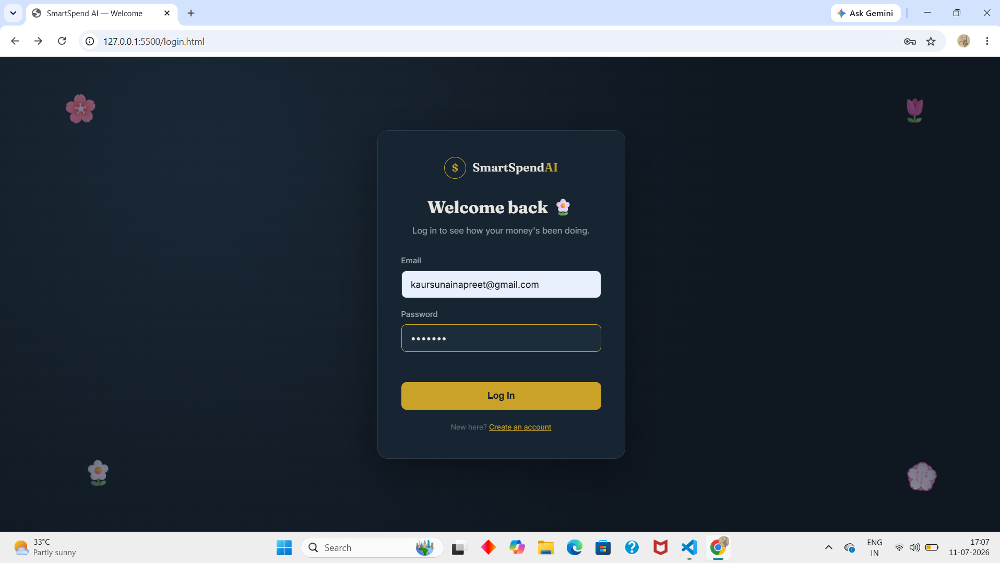
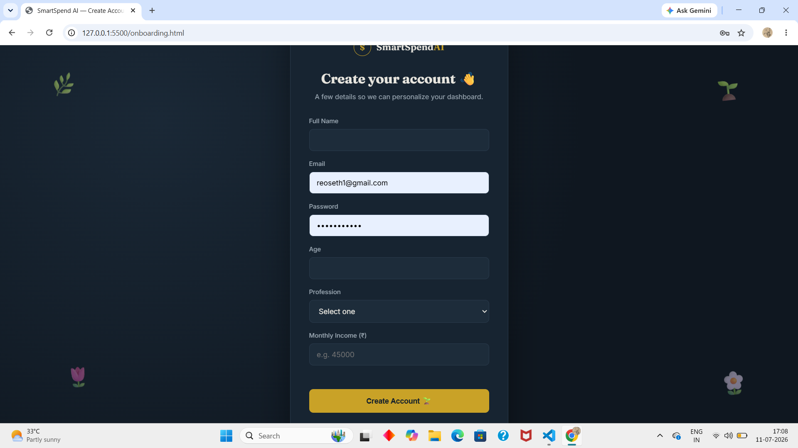
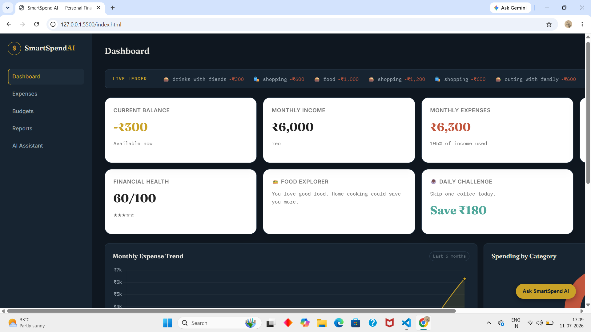
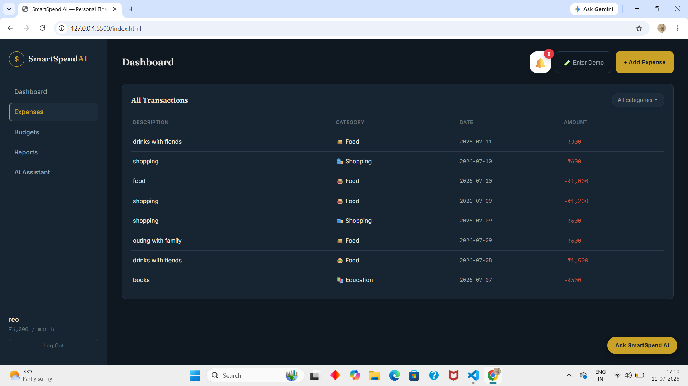
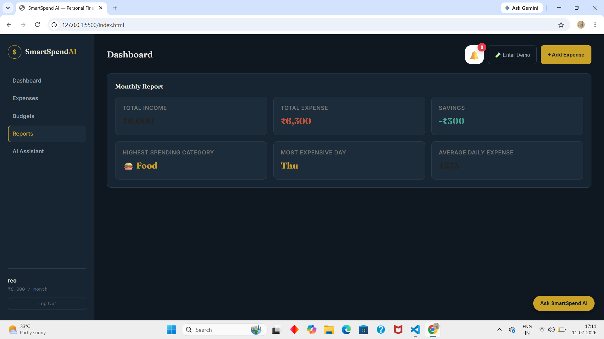
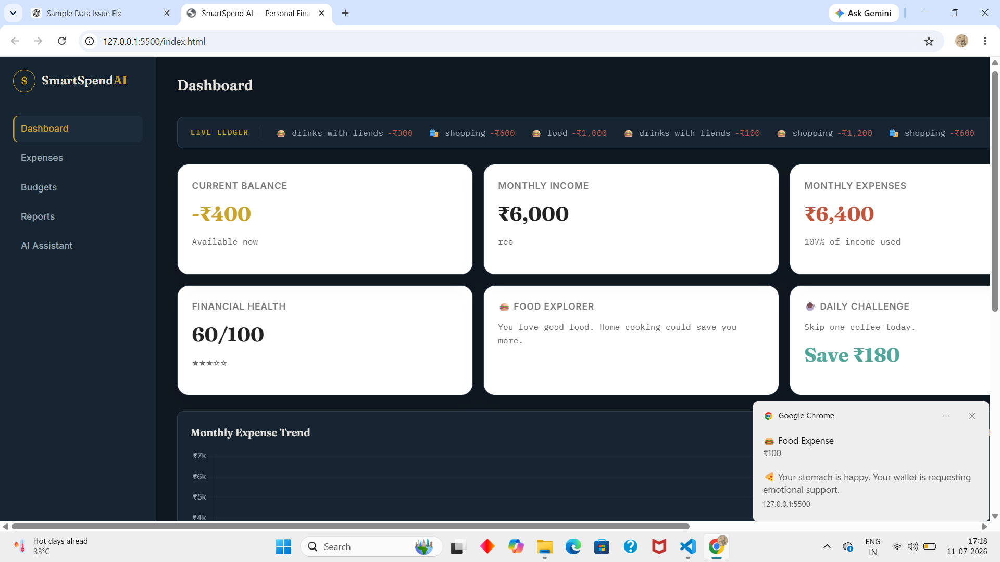

<div align="center">

# 💰 SmartSpend AI

### AI-Powered Personal Finance Intelligence Platform

Track • Analyze • Budget • Get AI-Powered Financial Insights

---


---

*A modern AI-powered finance platform that combines expense tracking, budgeting, analytics, browser notifications, and conversational AI to help users make smarter financial decisions.*

</div>

---

# 📖 About The Project

Managing personal finances is often difficult due to scattered transactions, poor spending awareness, and the lack of intelligent financial guidance.

**SmartSpend AI** addresses these challenges by providing a complete financial management platform that allows users to:

- Track daily expenses
- Monitor monthly budgets
- Visualize spending trends
- Receive intelligent financial insights
- Chat with an AI financial assistant
- Receive browser notifications for important financial events

Unlike traditional expense trackers, SmartSpend AI integrates **Google Gemini AI** to provide personalized financial analysis and recommendations based on user spending behavior.

---

# ✨ Features

## 🔐 Authentication

- User Registration
- Secure Login
- Session Management
- Personalized Dashboard

---

## 💸 Expense Management

- Add New Expenses
- Delete Expenses
- Category-wise Expense Tracking
- Split Expenses Across Multiple Categories
- Payment Method Tracking
- Transaction History

---

## 📊 Interactive Dashboard

Dashboard includes:

- Monthly Income
- Total Expenses
- Remaining Balance
- Monthly Savings
- Budget Overview
- Category-wise Spending

---

## 📈 Financial Analytics

Interactive charts built using Chart.js

- Monthly Expense Trend
- Weekly Spending
- Income vs Expense
- Category Distribution
- Budget Utilization

---

## 🤖 AI Financial Assistant

Powered by **Google Gemini**

The assistant understands your financial data and answers questions like:

- How much did I spend this month?
- Which category costs me the most?
- Give me saving tips.
- Analyze my spending.
- Suggest a monthly budget.
- Where can I reduce unnecessary expenses?

---

## 🔔 Browser Notifications

Receive intelligent reminders including:

- Budget Limit Alerts
- Overspending Warnings
- Monthly Summary Notifications
- Smart Saving Suggestions

---

## 🧪 Demo Mode

Explore SmartSpend AI without affecting personal data.

Demo Mode provides:

- Sample Expenses
- Sample Budgets
- Sample Analytics
- AI Insights
- Interactive Dashboard

---

## 🎨 Modern User Interface

Designed with a premium dashboard experience featuring:

- Responsive Layout
- Modern Financial UI
- Smooth Animations
- Interactive Cards
- Real-Time Charts
- Professional Color Palette

---

# 🏗 System Architecture

```
                User
                  │
                  ▼
        HTML • CSS • JavaScript
                  │
                  ▼
         Flask REST API Backend
                  │
      ┌───────────┴───────────┐
      ▼                       ▼
 SQLite Database        Google Gemini AI
      │                       │
      └───────────┬───────────┘
                  ▼
        Browser Notifications
```

---

# ⚙ Technology Stack

## Frontend

- HTML5
- CSS3
- JavaScript (ES6)
- Chart.js

---

## Backend

- Python
- Flask
- Flask SQLAlchemy

---

## Database

- SQLite

---

## Artificial Intelligence

- Google Gemini API

---

## Browser APIs

- Browser Notification API

---

# 📁 Project Structure

```
SmartSpendAI
│
├── backend
│   ├── app.py
│   ├── models.py
│   ├── auth_routes.py
│   ├── expense_routes.py
│   ├── analytics_routes.py
│   ├── summary_routes.py
│   ├── ai_routes.py
│   └── requirements.txt
│
├── css
│   ├── style.css
│   └── auth.css
│
├── js
│   ├── ai.js
│   ├── charts.js
│   ├── dashboard.js
│   ├── expense.js
│   ├── notifications.js
│   ├── browserNotifications.js
│   ├── router.js
│   ├── session.js
│   └── ...
│
├── index.html
├── login.html
├── onboarding.html
└── README.md
```

---

# 🚀 Installation

## Clone Repository

```bash
git clone https://github.com/kaursunainapreet-lgtm/SmartSpendAI.git
```

---

## Navigate

```bash
cd SmartSpendAI
```

---

## Create Virtual Environment

```bash
python -m venv venv
```

---

## Activate Environment

Windows

```bash
venv\Scripts\activate
```

---

## Install Dependencies

```bash
pip install -r backend/requirements.txt
```

---

## Configure Environment Variables

Create a file named

```
.env
```

inside the backend folder.

Add

```env
GEMINI_API_KEY=YOUR_API_KEY
```

---

## Run

```bash
python backend/app.py
```

Visit

```
http://127.0.0.1:5000
```

---

# 📸 Screenshots
# 📸 Application Screenshots

## 🔐 Login Page

<p align="center">

</p>

---

## 👤 User Onboarding

<p align="center">

</p>

---

## 📊 Dashboard

<p align="center">

</p>

---

## 📈 Complete Dashboard

<p align="center">

</p>

---

## 📉 Graphical Insights

<p align="center">

</p>

---

## 💸 Expense Management

<p align="center">

</p>

---

## 📋 Reports

<p align="center">

</p>

---

## 🤖 AI Financial Assistant

<p align="center">

</p>

---

## 🔔 Browser Notifications

<p align="center">

</p>

# 🔄 Project Workflow

```
User Login
      │
      ▼
Dashboard Loads
      │
      ▼
Expense Management
      │
      ▼
Database Updated
      │
      ▼
Analytics Generated
      │
      ▼
AI Insights
      │
      ▼
Browser Notifications
```

---

# 💡 Key Highlights

- Full Stack Web Application
- AI Integration using Google Gemini
- Browser Notification Support
- Responsive Dashboard
- RESTful API Architecture
- Interactive Financial Analytics
- Modern UI/UX
- Demo Mode
- Budget Management
- Expense Splitting

---

# 🎯 Future Enhancements

- PostgreSQL Support
- OCR Receipt Scanner
- Voice Assistant
- Email Notifications
- PDF Report Export
- Excel Export
- Dark Mode
- Cloud Deployment
- Mobile Application
- Multi-Currency Support

---

# 📚 Learning Outcomes

This project demonstrates practical understanding of:

- Full Stack Web Development
- REST APIs
- Flask Backend Development
- SQLAlchemy ORM
- Authentication
- AI Integration
- Browser APIs
- Data Visualization
- Frontend–Backend Communication
- Git & GitHub

---

# 👩‍💻 Author

## **Sunainapreet Kaur**

**B.Sc. Artificial Intelligence & Data Science (Final Year Student)**

Passionate about Artificial Intelligence, Machine Learning, Data Analytics, and Full-Stack Development.

GitHub:

https://github.com/kaursunainapreet-lgtm

---

# 📄 License

This project is developed for educational and portfolio purposes.

---

<div align="center">

## ⭐ If you found this project useful, consider giving it a Star!

Thank you for visiting the repository.

</div>